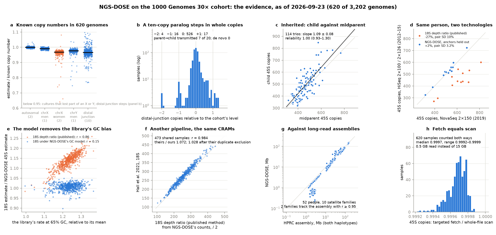

# NGS-DOSE on the 1000 Genomes 30× cohort

Results of running [NGS-DOSE](https://github.com/jlanej/NGS-DOSE) — rDNA copy number and other
multi-copy sequence from short-read genomes — on the expanded 1000 Genomes cohort (3,202 samples,
602 trios; NYGC 30× CRAMs, GRCh38), and everything about that run: the pipeline that drives the
cohort through the method, the pilot, the page and the assessments built from the counts, and the
studies that hold the estimates against assemblies, ddPCR and an independent review. NGS-DOSE
itself stays generic; this repository is where the 1000 Genomes work lives. Published as the run
proceeds, partial results included.

**The page: [jlanej.github.io/NGS-DOSE-1000G](https://jlanej.github.io/NGS-DOSE-1000G/)** —
what is measured and why, and the evidence that it works, recomputed from the files here.



**[docs/trio_report.pdf](docs/trio_report.pdf)** is the same case as a document, focused on the trios;
**[docs/EVIDENCE.md](docs/EVIDENCE.md)** is the write-up — each finding with its number, what it rules out,
and what is not yet shown — as a dated snapshot (735 genomes, 2026-09-23); the page carries the current numbers.

| path | what |
| --- | --- |
| `counts_scan/<sample>.json.gz` | whole-file scan of one CRAM: fragment-end counts per class and unit position, control-region counts, GC tables, where class reads were aligned and what else sits in those bins (~240 kB) |
| `counts_fetch/<sample>.json.gz` | the targeted fetch of the same CRAM (~70 kB): the control and truth regions, chrM, chrEBV and the 80 sink intervals of the 45S, the 5S and the distal junction (the sinks file before the telomere was added, sha256 9dd52ba1…; no telomere or satellite panel, no unmapped bin; every fetch so far is from engine build fae1124; with a newer image, whose bundle has the telomere's sinks, the pipeline's default `FETCH_PANELS` fetches the telomere too, see [pipeline/README.md](pipeline/README.md)). This is what a biobank-scale run returns for these classes on a pipeline whose sinks are known. The sinks here were learned from NYGC bwa-mem CRAMs, so a biobank on another pipeline (DRAGEN: UK Biobank, All of Us) must first learn its own from whole-file scans of a subset of its CRAMs |
| `docs/` | the page (`index.html`), every number behind it (`report.json`), every table (`data/*.tsv`), the figure, the PDF and the write-up; served by GitHub Pages |
| `report/` | the page generator (`python -m report`), the evidence figure and the trio PDF, on top of the `ngsdose` library |
| `pipeline/` | the cohort run for a SLURM cluster or a plain loop, container-only ([README](pipeline/README.md)) |
| `pilot/` | twelve genomes, four trios, each also as an older library of the same cell line: counts, evaluation, report and figure |
| `meta/` | the pedigree, the Hall et al. 2021 table, NGS-PCA's per-sample QC and its coverage PCs (`ngspca/`), the HPRC annotation keys |
| `hprc_censat/` | HPRC release-2 CenSat annotations of the cohort's members (fetched by `regenerate.sh`) |
| `assembly_rdna/` | what the HPRC assemblies hold of the rDNA, and NGS-DOSE against assemblies, ddPCR and FISH ([README](assembly_rdna/README.md)) |
| `review/` | an independent review with its re-analysis of the committed tables |
| `tests/` | the report on the pilot and on a slice of the cohort, the pilot's regression tests, the scripts |
| `regenerate.sh` | rebuilds `docs/` from the counts |

The counts files are the primary data: no reads, no genotypes, nothing a 1000 Genomes
consent does not cover. Everything else is derived from them by `report/` on top of the `ngsdose`
library, so anyone can re-run the analysis — or a different one — without touching a CRAM.

## Regenerate

```bash
pip install git+https://github.com/jlanej/NGS-DOSE matplotlib   # the method (or: pip install -e ../NGS-DOSE)
bash regenerate.sh                                              # -> docs/
```

The bundle the estimates need ships with the NGS-DOSE checkout (or the release's resources tarball):
set `NGSDOSE_RESOURCES` to its `GRCh38` directory unless the package is installed editable from a checkout.
`pytest` runs the tests the same way (`.github/workflows/ci.yml` does both, and runs the pipeline
container-only on the published image).

## Data sources and attribution

1000 Genomes 30× CRAMs: Byrska-Bishop et al., *Cell* 185:3426 (2022), AWS Open Data mirror;
1000 Genomes data are open access (https://www.internationalgenome.org/IGSR_disclaimer).
`meta/hall2021_MOESM1.txt`: Supplementary Data 1 of Hall, Turner & Queitsch, *Sci Rep* 11:449
(2021), doi:10.1038/s41598-020-80049-y, CC BY 4.0, unmodified.
`meta/ngspca_sample_qc.tsv`: per-sample QC of the same cohort from
[NGS-PCA-Manuscript](https://github.com/jlanej/NGS-PCA-Manuscript) (`1000G/qc_output/sample_qc.tsv`;
mosdepth coverage, mitochondrial copy number, X/Y coverage ratios, inferred sex, release batch), MIT, unmodified.
